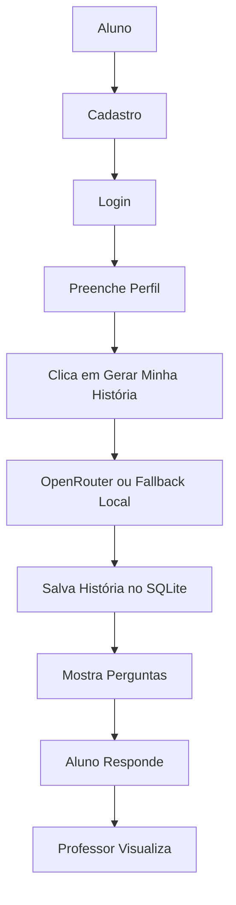
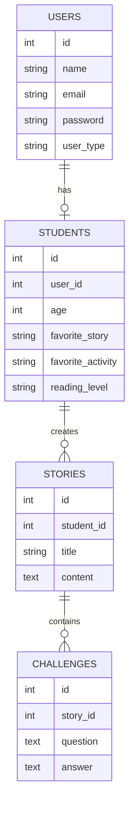

# Trilhas Mágicas — Plataforma Inteligente de Alfabetização Hospitalar (IMIP)

Projeto simples, local e executável no VS Code com **Flask + SQLite**.

## O que faz
- Cadastro de **aluno** e **professor**
- Login com senha criptografada em **bcrypt**
- Perfil do aluno com:
  - idade
  - obra favorita
  - atividade favorita
  - nível de leitura
- Geração de história personalizada com **OpenRouter**
- Criação automática de **3 perguntas**
- Salvamento no banco **SQLite**
- Painel do professor para ver alunos e histórias

## Estrutura
```text
project/
app.py
config.py
requirements.txt
README.md
.env.example
database/
trilhas.db
models/
user.py
student.py
story.py
challenge.py
routes/
auth.py
student.py
teacher.py
story.py
services/
openrouter_service.py
templates/
base.html
home.html
login.html
register.html
student_dashboard.html
teacher_dashboard.html
create_story.html
story.html
quiz.html
reports.html
static/
css/style.css
js/app.js
img/
```

## Como rodar
### 1) Criar ambiente virtual
```bash
python -m venv .venv
```

### 2) Ativar
Windows:
```bash
.venv\Scripts\activate
```

Mac/Linux:
```bash
source .venv/bin/activate
```

### 3) Instalar dependências
```bash
pip install -r requirements.txt
```

### 4) Criar o `.env`
Copie o arquivo `.env.example` para `.env` e preencha:
```env
OPENROUTER_API_KEY=sua_chave
SECRET_KEY=troque_esta_chave
OPENROUTER_MODEL=openai/gpt-4o-mini
```

### 5) Executar
```bash
python app.py
```

### 6) Abrir no navegador
```text
http://127.0.0.1:5000
```

## Fluxo do sistema
1. Usuário se cadastra
2. Faz login
3. Aluno completa o perfil
4. Clica em **Gerar Minha História**
5. A IA cria a história e as perguntas
6. O sistema salva tudo no SQLite
7. O professor vê os dados no painel

## Sobre a IA
Se a chave da OpenRouter não estiver configurada, o sistema **não quebra**.  
Ele usa uma história de reserva local para continuar funcionando.

## Banco de dados
O arquivo é criado automaticamente em:
```text
database/trilhas.db
```

## Diagramas Mermaid

### Fluxo principal


### Modelo de dados


## Observações
- Projeto propositalmente simples
- Feito para funcionar localmente com o menor número possível de instalações
- Ideal para demonstração em sala de aula
